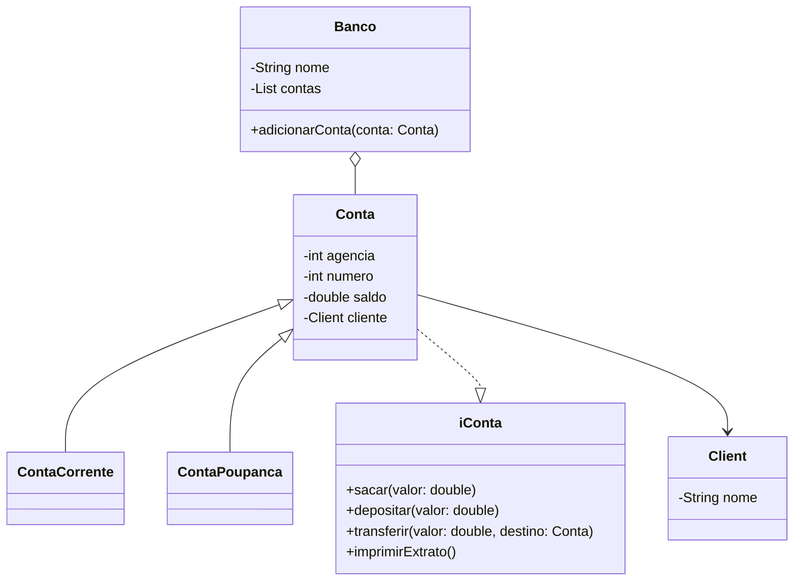

# 🏦 Banco Digital em Java – Orientação a Objetos

## 📌 Descrição

Este projeto implementa um **Banco Digital** em **Java**, aplicando os pilares da **Programação Orientada a Objetos (POO)**.

O sistema permite criar contas **Corrente** e **Poupança**, vincular clientes a um banco e realizar operações como:

* Depósito
* Saque
* Transferência entre contas da mesma instituição
* Exibição de extratos

---

## 🧩 Conceitos de POO Aplicados

### 🔹 Abstração

A classe **Conta** define os comportamentos comuns de uma conta bancária, enquanto classes específicas (**ContaCorrente** e **ContaPoupanca**) implementam especializações.

### 🔹 Encapsulamento

Os atributos das classes são privados, sendo acessados apenas por métodos públicos (`depositar`, `sacar`, `transferir`, `imprimirExtrato`).

### 🔹 Herança

As classes **ContaCorrente** e **ContaPoupanca** herdam da classe abstrata **Conta**, aproveitando código comum.

### 🔹 Polimorfismo

A interface **iConta** permite que diferentes tipos de contas sejam tratadas de forma uniforme, respeitando contratos de implementação.

---

## 📂 Estrutura do Projeto

```
src/app/
├── Banco.java
├── Client.java
├── Conta.java
├── ContaCorrente.java
├── ContaPoupanca.java
└── iConta.java
```

* **Banco.java** → Representa a instituição bancária que gerencia clientes e contas.
* **Client.java** → Representa o cliente do banco.
* **iConta.java** → Interface que define o contrato das operações bancárias.
* **Conta.java** → Classe abstrata que implementa parte de `iConta` e serve como base para contas.
* **ContaCorrente.java** → Especialização da conta corrente.
* **ContaPoupanca.java** → Especialização da conta poupança.

---

## ⚙️ Funcionalidades

✔ Criar cliente
✔ Criar conta corrente ou poupança
✔ Depositar valores
✔ Realizar saques
✔ Transferir entre contas
✔ Exibir extrato

---

## 🖥️ Exemplo de Uso

```java
public class Main {
    public static void main(String[] args) {
        Banco banco = new Banco("Banco Digital");

        Client joao = new Client("João");
        Conta cc = new ContaCorrente(joao);
        Conta poupanca = new ContaPoupanca(joao);

        banco.adicionarConta(cc);
        banco.adicionarConta(poupanca);

        cc.depositar(1000);
        cc.transferir(300, poupanca);

        cc.imprimirExtrato();       // Saldo: 700
        poupanca.imprimirExtrato(); // Saldo: 300
    }
}
```

---

## 🛠️ Tecnologias

* **Java 17+**
* **POO** (Abstração, Encapsulamento, Herança, Polimorfismo)

---

## 📊 UML Simplificado



---

## ✍️ Autor

* [João Luis de Almeida Vagos](https://github.com/SEU-USUARIO)

---
